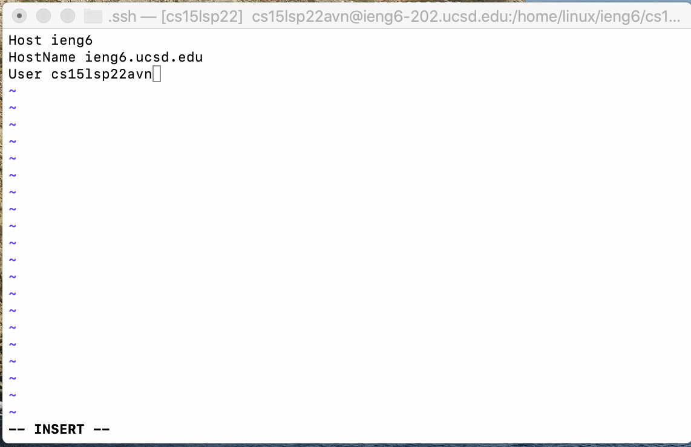
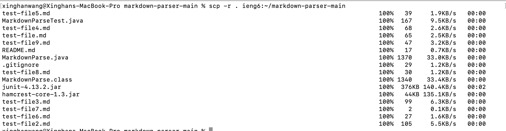

# Lab Group Choice Options (1-3) Implementation

## Choice 1

1.1 **`.ssh/config` file edit**: This is my `.ssh/config` and I used `vim` to edit it.
 
 
 
1.2 **`ssh` loggin alias**: The alias I choose is simply `ieng6` since I feel like it is really effective and easy to remember.
 

 
 1.3 **`scp` a file using loggin alias**: there is a word file named `1M.docx` on my computer and I transfered it to the remote computer and named it `1MRemote.docx`
 
 
 ## Choice 2
 2.1 **public key storage in Github and user account**: In the second screenshot, `github_key_remote` is the key I stored in github.
  
  
  
 2.2 **private key storage**: `id_rsa` is my private key storage.
  
  
 2.3 **`git` push a change from ieng6**: I added a blank line in my `Midterm.java` file (which was the file I used for the skill demo). Here is how I pushed this change:
  
  
  
 2.4 **Link for the resulting commit**: This is my github page after this change is made
  
  
  ## Choice 3
 3.1 **copying whole markdown-parse directory to ieng6**: I copyed our markdown-parse directory named `markdown-parser-main` which contains 9 tests file to the remote computer.
  
  
 3.2 **compile the tests on ieng6 account**: There were 1 test in our Tester file and this is the result after running it on the remote computer:
  
  
 3.3 **combining commands**: I used the inspiration from our first lab to combine everything in to one line and runed it:
  
  
 
 
 
